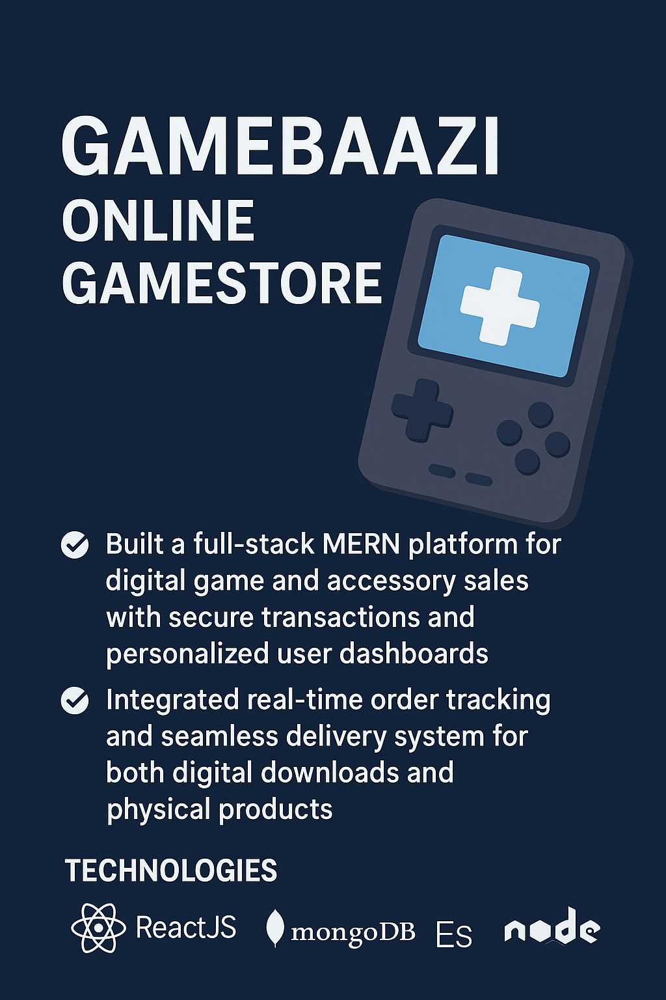

# 🎮 GameBaazi – Online Game Store  

## 📌 Overview  
**GameBaazi** is a **full-stack MERN platform** designed for digital game and accessory sales.  
It provides a seamless shopping experience with **secure transactions**, **real-time order tracking**, and personalized user dashboards.  
The platform supports both **digital downloads** and **physical product deliveries**.  

---

## ✨ Key Features  
- 🛒 Browse and purchase **digital games** and **gaming accessories**.  
- 🔐 **Secure user authentication** and payment handling.  
- 📦 Real-time **order tracking system**.  
- 👤 Personalized **user dashboards** for orders and purchases.  
- 🚚 Seamless delivery support for digital + physical products.  
- ⚡ Built with a scalable and modular **MERN stack** architecture.  

---

## 🛠️ Technologies  
- **ReactJS** – Frontend  
- **NodeJS** – Backend  
- **ExpressJS** – API Layer  
- **MongoDB** – Database  

---
